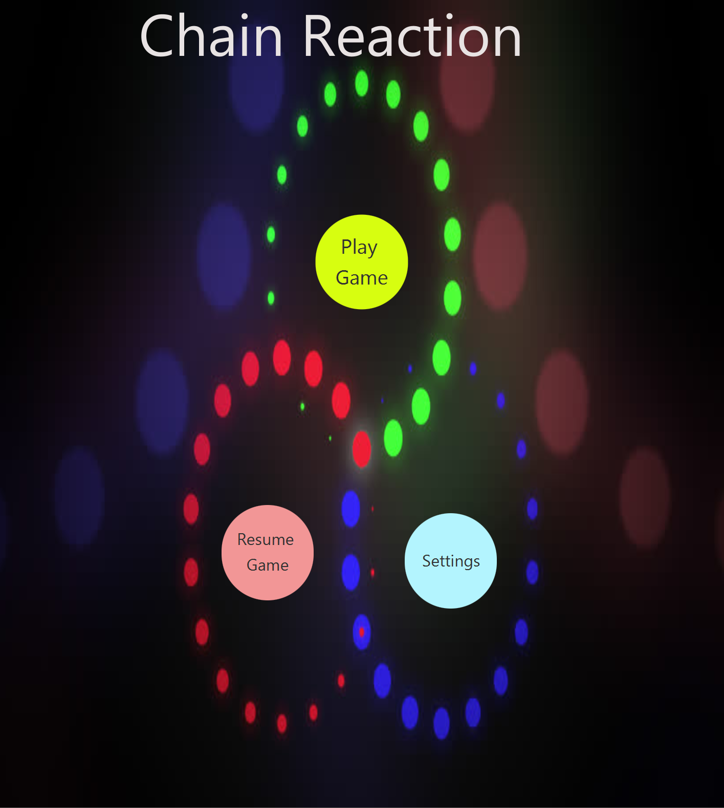
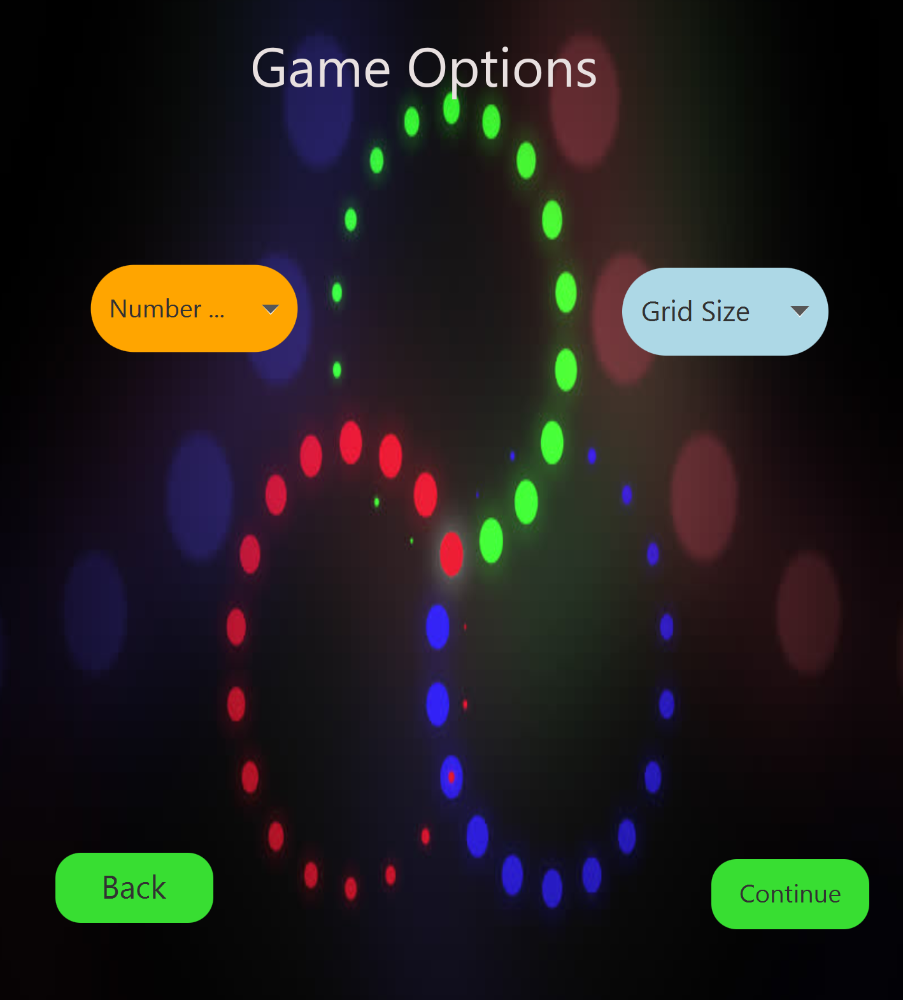
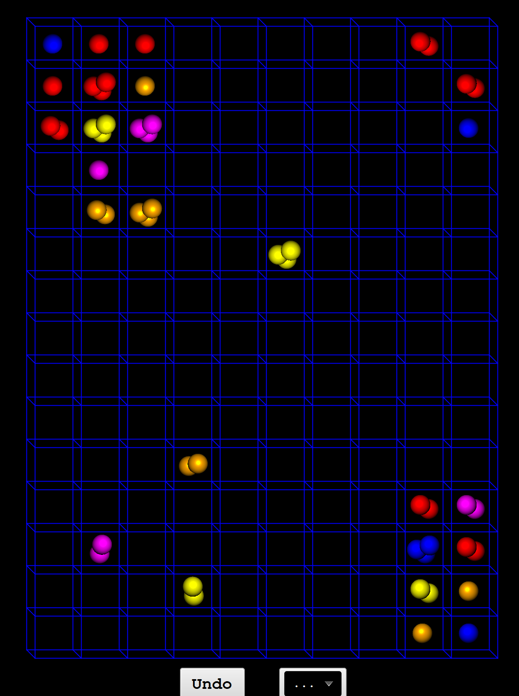

# Chain-Reaction-Java
<b> Course Project for Advanced Programming (CSE201)</b> 
<b> Instructor : Dr. Vivek Kumar </b> 
 
This project aims at building a multi-player arcade game.
It is based on creating a JavaFX application for a multiplayer game - Chain Reaction. It's a strategy game for 2to 8 players.The objective of this game is to take control of the board by eliminating your  opponents.

<b> Rules of the Game </b> 

1. The gameplay takes place in a m x n board.
2. For each cell in the board, we define a critical mass. The critical mass is equal to the
number of orthogonally adjacent cells. That would be 4 for usual cells, 3 for cells in
the edge and 2 for cells in the corner.
3. All cells are initially empty. The Red and the Green player take turns to place "orbs"
of their corresponding colors. The Red player can only place an (red) orb in an empty
cell or a cell which already contains one or more red orbs. When two or more orbs
are placed in the same cell, they stack up.
4. When a cell is loaded with a number of orbs equal to its critical mass, the stack
immediately explodes. As a result of the explosion, to each of the orthogonally
adjacent cells, an orb is added and the initial cell loses as many orbs as its critical
mass. The explosions might result in overloading of an adjacent cell and the chain
reaction of explosion continues until every cell is stable.
5. When a red cell explodes and there are green cells around, the green cells are try to
red and the other rules of explosions still follow. The same rule is applicable for other
colors.
6. The winner is the one who eliminates every other player's orbs.

<b> Structure and Features of the Game </b> 

1. Main page must provide: 
a. Option to choose number of players (2 to 8). 
b. Option to choose grid size, (9x6 or 15x10). 
c. Button to start the game. 
d. Resume Button - This button should only be visible on main page when the last game played has not finished and a move has been made. The game will resume from the last saved state. 
e. Settings Button - To open the settings page. 
2. Settings page: 
a. It should contain a list of 8 players. 
b. Clicking on a row corresponding to a player should allow to configure the colour of the ball for that player. 
c. Ensure that colour of the balls are different for each player in the game. 
3. When the game starts: 
a. A GUI similar to that of the game in playstore. 
b. Option to redo the last step. 
c. A drop down with two options: 
i. Start the game again 
ii. Exit and go to main page 
4. Animation: 
a. If more than one ball in a cell, then they must rotate as a unit within the cell. 
b. Transition should be visible when balls are splitting. 
5. Save the state of the game at any point of time. 
6. Also save the state in abnormal conditions (user presses cross, presses home button (if any), etc.) 

